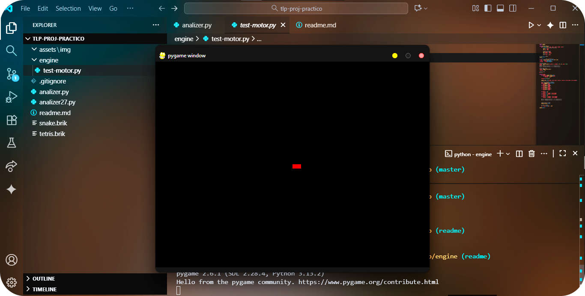

# Juegos de Ladrillos


---

## Descripción

Este proyecto consiste en construir un motor de juegos compacto y eficiente para hardware limitado (disquete 1.44MB, Windows XP, AMD Athlon XP).

Incluye un lenguaje propio para definir reglas de juegos clásicos como Snake y Tetris, y un motor gráfico para ejecutar estos juegos con control de entradas.

---

## Entregas

### Entrega 1: Analizador Léxico y Sintáctico

- Implementación en Python 2.7 de un analizador que tokeniza y genera un árbol sintáctico a partir de archivos `.brik`.
- Construcción de una tabla de símbolos para almacenar propiedades del juego.
- Juegos implementados: Snake y Tetris con reglas definidas en el lenguaje propio.

### Entrega 2: Motor Gráfico y Control de Entradas

- Motor gráfico en Pygame que crea una ventana 640x480.
- Implementación del game loop que maneja eventos, actualizaciones y renderizado.
- Funciones para dibujar ladrillos, puntuación y texto.
- Control de movimiento mediante teclado para interactuar con los juegos.

---

## Tecnologías

- Python 2.7 (compatible con scripts `analizador.py` y `analizer27.py`)
- Pygame 2.1.2 (para motor gráfico)
- Requiere Windows XP / AMD Athlon XP (para cumplir restricciones de hardware)

---

## Instalación

Para instalar dependencias:

```
pip install pygame
```

##Uso

- **Para ejecutar el analizador léxico y sintáctico (Entrega 1):**

```
python analizador.py
```
Cuando se ejecute, ingresa el nombre del archivo .brik que quieres procesar (ejemplo: snake).

- ** Para ejecutar el motor gráfico (Entrega 2):**

```
python engine/test-motor.py
```

##Estructura del repositorio
```
├──assets/
│└──── img/
│└────── 1.png
│
├──docs/
│├──── entrega1.md
│└──── entrega2.md
│
├── engine/
│└────   test-motor.py  # Motor gráfico con Pygame
│
├──.gitignore
├──analizer.py                # Analizador léxico y sintáctico
├──analizer27.py            # Versión alternativa del analizador
├──readme.md               # Documentación
├──snake.brik                 # Juego Snake
├──tetris.brik                  # Juego Tetris
```

## Ejemplo de archivo .brik

### Fragmento de configuración para Snake

name { "Snake the game" }
version { 0.1 }
board_size { [15, 15] }
max_speed { 10 }

let controls {
    mov_l: LEFT_ARROW,
    mov_r: RIGHT_ARROW,
    mov_u: UP_ARROW,
    mov_d: DOWN_ARROW,
}

##Documentación Técnica
Cada entrega tiene documentación:
**- Entrega 1: Analizador **
**- Entrega 2: Motor Gráfico**

***Este proyecto es con fines académicos para el curso de TLP*.**
Profesor: Fernán A. Villa-Garzón
Monitora: Carolina Valencia-García
Curso: Teoría de Lenguajes de Programación
Universidad Nacional de Colombia
